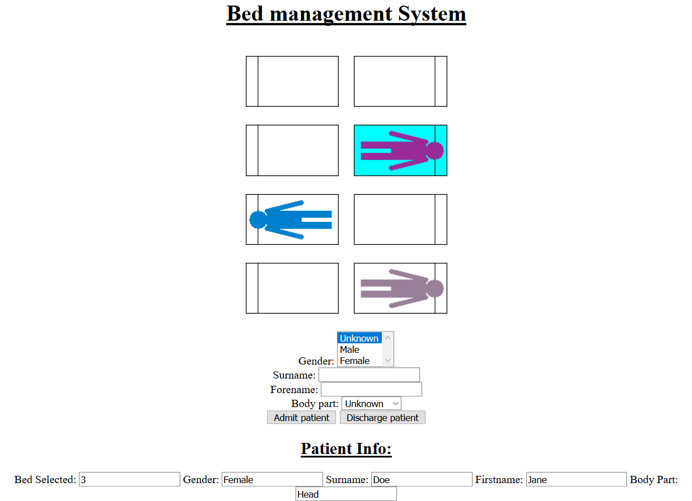

# HospitalBeds
University coursework task for module soft051(Year 0 of computing with foundation year) grade receieved: 73%
The task was to create a bed tracking software for nurses to use.
The patients initially admitted had to be anonymous to allow the hospitially staff to book them in quickly and then can change them later.
The patients data that had to be stored: gender, name(forename and surname) and the body part that has been affected.

